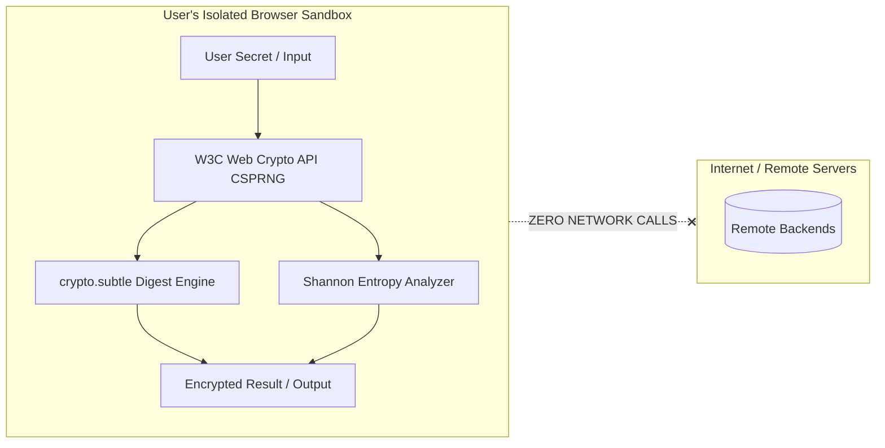

# 🛡️ SecureGen (Your Security Companion)

<div align="center">

[](https://securegenr.vercel.app/)
[](https://react.dev/)
[](https://www.typescriptlang.org/)
[](https://developer.mozilla.org/en-US/docs/Web/API/Web_Crypto_API)
[](https://tailwindcss.com/)
[](LICENSE)

### **Zero-Knowledge, Client-Side Cryptographic Privacy & Security Utility Suite**

*Seven essential security tools—password generation, Shannon entropy calculation, brute-force crack-time estimation, cryptographic hashing (SHA/MD5), Diceware passphrases, UUID v4 creation, and QR codes—running 100% locally in your browser with zero server transmission.*

---

[Live Application](https://securegenr.vercel.app/) • [Security Tools](#-security-tools-suite) • [Privacy Guarantee](#-zero-knowledge-architecture) • [Tech Stack](#-tech-stack--architecture) • [Getting Started](#-getting-started)

</div>

---

## 📌 Problem & Motivation

Most online password generators, hash calculators, and security checkers send user input across the network to backend servers, creating serious privacy risks, potential logging vulnerabilities, and MITM intercept exposure.

**SecureGen** operates on a strict **Zero-Knowledge, 100% Client-Side** architecture. Every cryptographic operation—from pseudo-random number generation (CSPRNG) to SHA hashing and entropy evaluation—is executed locally in the browser tab using the standard **W3C Web Crypto API (`window.crypto.subtle`)**. No data ever leaves your device.

---

## 🛠️ Security Tools Suite

| Tool | Route | Core Capability | Cryptographic Mechanism |
| :--- | :--- | :--- | :--- |
| 🔑 **Password Generator** | `/password-generator` | High-entropy password creation with customizable rules | `crypto.getRandomValues()` CSPRNG |
| 📊 **Strength & Crack-Time** | `/password-strength` | Real-time Shannon entropy & brute-force time estimator | Combinatorial search space analysis |
| 💬 **Passphrase Generator** | `/passphrase-generator` | Memorable Diceware-style multi-word passphrases | High-entropy dictionary sampling |
| ⚡ **Hash Calculator** | `/hash-generator` | Instant client-side cryptographic hashing | `crypto.subtle.digest` (SHA-256/512/1) |
| 🆔 **UUID v4 Generator** | `/uuid-generator` | Cryptographically random UUID v4 with bulk export | RFC 4122 compliant randomness |
| 👤 **Handle & Identity** | `/username-generator` | Privacy-preserving pseudonym & handle synthesis | Phonetic & thematic lexical combinations |
| 📱 **QR Code Generator** | `/qr-generator` | Local QR code generation for Wi-Fi, URLs, and text | Offline SVG/Canvas matrix renderer |

---

## 🔒 Zero-Knowledge Architecture



- **No Remote Telemetry on Secrets:** Cryptographic operations are mathematically isolated within the browser execution context.
- **Hardware-Random Entropy:** Leverages OS-level entropy pools via `window.crypto.getRandomValues`.
- **Offline Capable:** Can be cached as a PWA and executed entirely without an active internet connection.

---

## 🛠️ Tech Stack & Architecture

- **Full-Stack Framework:** TanStack Start (`@tanstack/react-start`) + TanStack Router
- **Frontend Core:** React 19.2 + TypeScript 5.x
- **Cryptographic Primitives:** W3C Web Crypto API (`SubtleCrypto`), `qrcode`
- **UI & Styling:** Tailwind CSS v4 + Radix UI Primitives (`@radix-ui/react-*`) + Lucide Icons
- **Data Visualizations:** Recharts 2.15 (for entropy distribution charts)
- **Deployment:** Vercel Edge Network

---

## 📁 Project Structure

```
securegen-your-security-companion/
├── src/
│   ├── routes/
│   │   ├── __root.tsx                # Global layout, theme switcher, and navigation
│   │   ├── index.tsx                 # Suite overview & dashboard
│   │   ├── password-generator.tsx    # Password synthesis engine
│   │   ├── password-strength.tsx     # Shannon entropy analyzer
│   │   ├── passphrase-generator.tsx  # Diceware passphrase engine
│   │   ├── hash-generator.tsx        # SHA-256 / SHA-512 digest tool
│   │   ├── uuid-generator.tsx        # RFC 4122 UUID v4 generator
│   │   ├── qr-generator.tsx          # Local QR code canvas builder
│   │   └── username-generator.tsx    # Pseudonym synthesis
│   ├── components/                   # Entropy meters, copy buttons, sliders, UI
│   ├── lib/                          # Web Crypto helpers, entropy math, wordlists
│   └── styles/
├── public/
├── package.json
└── vite.config.ts
```

---

## 🚀 Getting Started

### Prerequisites
- Node.js 18+ or Bun
- Modern web browser with Web Crypto API support (Chrome, Firefox, Safari, Edge)

### Installation

1. **Clone the repository:**
   ```bash
   git clone https://github.com/Aldtor/securegen-your-security-companion.git
   cd securegen-your-security-companion
   ```

2. **Install dependencies:**
   ```bash
   npm install
   # or
   bun install
   ```

3. **Start development server:**
   ```bash
   npm run dev
   # or
   bun dev
   ```

4. **Build production bundle:**
   ```bash
   npm run build
   ```

---

## 👤 Author

**Satyam Kumar (Aldtor)**
- 🌐 Portfolio: [aldtor.vercel.app](https://aldtor.vercel.app)
- 🐙 GitHub: [@Aldtor](https://github.com/Aldtor)
- 💼 LinkedIn: [linkedin.com/in/aldtor](https://in.linkedin.com/in/aldtor)

---

<div align="center">
  <sub>Built with ❤️ to keep personal digital security open, local, and private.</sub>
</div>
